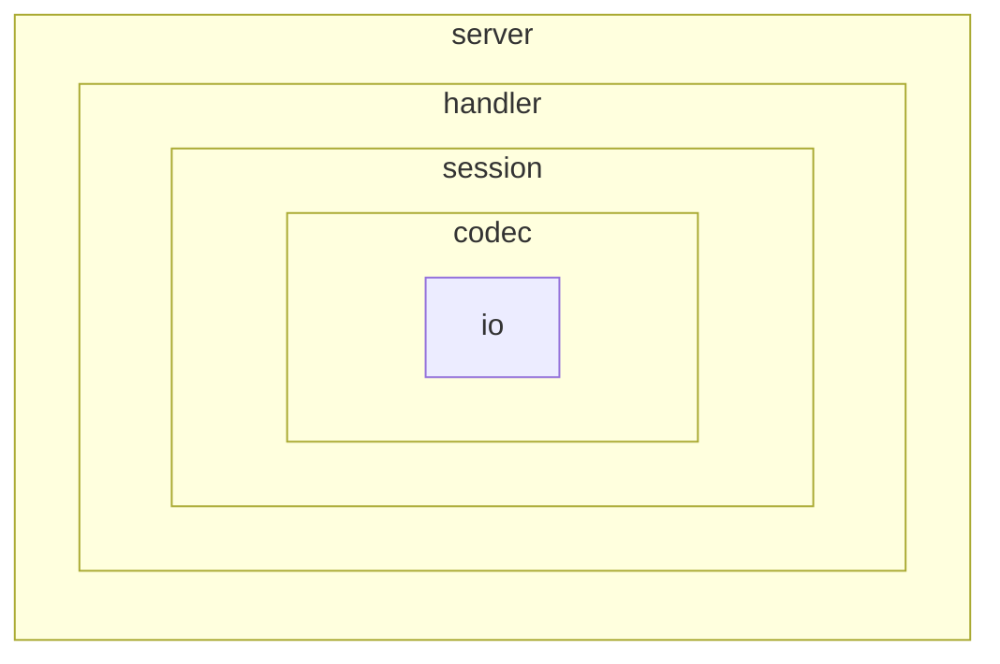

# net-link

封装 net，提供简单易用接口。

```go
func main() {
  // json data echo server
	err := net_link.ListenAndAccept("127.0.0.1:10086", codec.Json(), net_link.HandlerFunc(
		func(s *net_link.Session) error {
      
			receiver := new(demo.Student)
			if err := s.Read(receiver); err != nil {
				return errors.Trace(err)
			}
      
			if !reflect.DeepEqual(receiver, msg) {
				panic("read err")
			}
      
			if err := s.Write(receiver); err != nil {
				return errors.Trace(err)
			}
			return nil
		},
	))
}
```


## Server接口

```go
type Handler interface {
	handler(s *Session) error
}

// 同步Listen
ListenAndAccept(addr string, protocol Protocol, handler Handler) error

// 异步Dial
Dial(laddr, raddr string, protocol Protocol, handler Handler) error

// 同步Dial
DialSync(laddr, raddr string, protocol Protocol, handler Handler) error

// 异步处理Conn
ServeConn(conn net.Conn, protocol Protocol, handler Handler) error

// 同步处理Conn
ServeConnSync(conn net.Conn, protocol Protocol, handler Handler) error
```


## Session接口

Session 所有接口皆是线程安全的。

```go
type Session struct {}

// Protocol:codec的工厂函数, codec会负责解析io
func NewSession(rw io.ReadWriter, protocol Protocol, sendChanSize int) (*Session, error) 

// 返回原生io
// HiJack返回的io已经脱离了Session的控制，不再线程安全，如果需要并发读写，需要自行加解锁
func (s *Session) HiJack() io.ReadWriter

// 同步读入
func (s *Session) Read(msg interface{}) error

// 异步写入
func (s *Session) Write(msg interface{}) error

// 同步写入
func (s *Session) WriteSync(msg interface{}) error

// 会话ID
func (s *Session) ID() uint64

// session是否关闭
func (s *Session) IsClosed() bool

// 关闭session
// 可重复调用。但是不建议调用此函数，session退出、异常时会自动调用
func (s *Session) Close() error
```


## 解耦

将网络服务解耦成五部分：io、codec、session、handler、server。



1. io：TCP/UDP/UnixSocket/bufio…
2. codec 内嵌 io：编解码器。提供编解码能力。
3. session 内嵌 codec：会话。提供线程安全的读写操作。
4. handler 内嵌 session：处理函数。
5. server 内嵌 handler：由 handler 组成的服务。


### io

数据流。

```
rw io.ReadWriter
```

io 必须实现 io.Reader 和 io.Writer 接口，但是并不要求必须实现 io.Closer 接口（如果没有实现，将自动封装成 nopCloser）。这样就可以支持 bufio 等没有 close 函数的 io。


### codec

编解码器。内嵌 io 对象，编解码 io 流。

```go
type Codec interface {
	io.Closer
	Read(receiver interface{}) error
	Write(send interface{}) error
  // 返回原生io
	HiJack() io.ReadWriter
}

type Protocol interface {
	// 并不要求io实现closer接口
	NewCodec(rw io.ReadWriter) (Codec, error)
}
```

codec 除了提供 Read、Write 函数，还有一个 HiJack 函数负责返回原生 io。

Protocol 是 Codec 的工厂函数。


### Session

session 内嵌 codec，提供线程安全的读写操作。

实现面向 Session 编程。

提供 HiJack 函数以获取底层 connection，保留对连接的控制。


### handler

负责具体业务，负责操作 Session。

```go
type Handler interface {
	handler(s *Session) error
}

type HandlerFunc func(*Session) error

func (f HandlerFunc) handler(s *Session) error {
	return f(s)
}
```


### server

```go
err := ListenAndAccept("127.0.0.1:10086", codec.Json(), func(s *Session) error {
  // do something
}
```


## example

```go
// server
func main() {
	log.Info("---- server start ----")
  
	err := net_link.ListenAndAccept("127.0.0.1:10086", codec.Byte(), net_link.HandlerFunc(
		func(s *net_link.Session) error {
      
			receiver := make([]byte, 9)
			if err := s.Read(receiver); err != nil {
				return errors.Trace(err)
			}
      
			if !bytes.Equal(receiver, []byte{1, 2, 3, 4, 5, 6, 7, 8, 9}) {
				panic("read err")
			}
      
			tcpConn := s.HiJack()
			fmt.Println("remote addr:", tcpConn.(net.Conn).RemoteAddr())
      
			if _, err := tcpConn.Write([]byte{2, 3, 4}); err != nil {
				return errors.Trace(err)
			}
      
			return nil
		},
	))
  
	if err != nil {
		panic(err)
	}
}
```

```go
// client
func main() {
	log.Info("---- client start ----")
  
	err := net_link.DialSync("127.0.0.1:0", "127.0.0.1:10086", codec.Byte(), net_link.HandlerFunc(
		func(s *net_link.Session) error {
      
			msg := []byte{1, 2, 3, 4, 5, 6, 7, 8, 9}
			if err := s.WriteSync(msg); err != nil {
				return errors.Trace(err)
			}
      
			newMsg := make([]byte, 3)
			if err := s.Read(newMsg); err != nil {
				return errors.Trace(err)
			}
      
			if !reflect.DeepEqual(newMsg, []byte{2, 3, 4}) {
				panic("read err")
			}
      
			return nil
		},
	))
	if err != nil && !strings.Contains(err.Error(), "EOF") {
		panic(err)
	}
}
```


